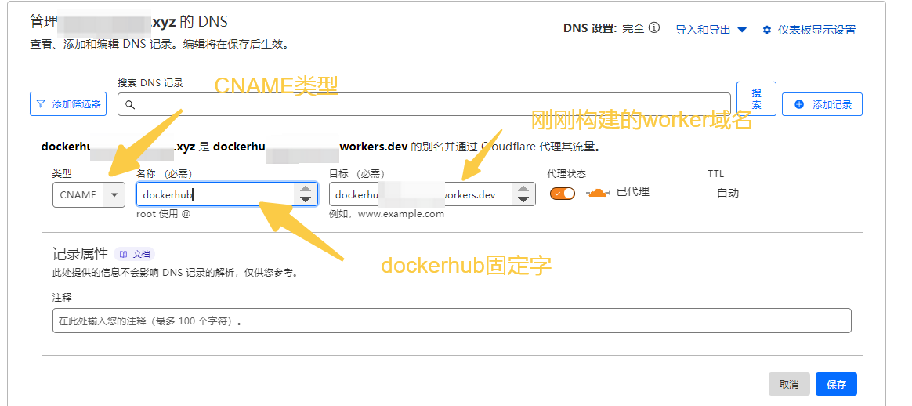

# 背景

<a href="https://atomhub.openatom.cn"></a>


# 部署

## 注册域名

由于国内屏蔽了`*.workers.dev`域名，所以我们需要一个自定义域名

请参考[cloudflare域名注册](https://dash.cloudflare.com/f30941f252e22dc7d4c5c5770873120f/domains/register)进行域名注册

或者任意**国外**域名注册商注册一个域名

或使用已有域名,请将域名托管到`cloudflare`上, 参考

* [参考博文](https://back2me.cn/skills/cloudflare.html)
* [参考视频](https://www.youtube.com/watch?v=7gvk9NbGAo0)
* [官方博文](https://blog.cloudflare.com/zh-cn/a-step-by-step-guide-to-transferring-domains-to-cloudflare-zh-cn)


## 一键部署

[](https://deploy.workers.cloudflare.com/?url=https://github.com/CodePeasant3/cloudflare-dockerhubhub)

一键部署，点击上面的按钮，然后按照提示操作即可.

其中可能会涉及到gitlab仓库的fork，action功能开启，以及cloudflare的账号授权等操作, 按照提示操作即可

取得你的worker的域名`*.yourname.workers.dev`


## 域名转发

由于国内屏蔽了`*.workers.dev`域名，所以我们需要将托管在cloudflare上的域名转发到`*.workers.dev`域名

1. 访问cloudflare仪表盘, 选择你的域名


2. 点击Worker路由，进入路由设置阶段


3. 添加记录，创建四个CNAME类型的,分别为`dockerhub.你的域名`, `k8s.你的域名`, `quay.你的域名`, `gcr.你的域名`




点击保存即可

# 使用

在配置文件`/etc/docker/daemon.json`中将docker默认的仓库地址更换

```
{
  "registry-mirrors": [
          "https://dockerhub.你的域名"
  ]
}

```


```
# 重启docker服务
sudo systemctl daemon-reload
sudo systemctl restart docker

# 从dockerhub代理地址中拉取镜像
sudo docker pull ubuntu:latest

# 登录
sudo docker login dockerhub.你的域名

```


下载其他仓库的镜像，诸如k8s

```
# 之前，被屏蔽，拉取失败
sudo docker pull registry.k8s.io/kube-apiserver:v1.28.11

# 现在, 通过代理地址拉取，成功
sudo docker pull k8s.你的域名/kube-apiserver:v1.28.11
```

# 总结
| 域名  | 目标 | 用途 |
| ---- | ---- | ---- |
| d.yourdomain | registry.hub.docker.com | dockerhub仓库代理 |
| ddd.yourdomain | registry.hub.docker.com | dockerhub仓库代理 |
| dockerhub.yourdomain | registry.hub.docker.com | dockerhub仓库代理 |
| k.yourdomain | registry.k8s.io | k8s仓库代理 |
| kkk.yourdomain | registry.k8s.io | k8s仓库代理 |
| k8s.yourdomain | registry.k8s.io | k8s仓库代理 |
| q.yourdomain | quay.io | quay仓库代理 |
| qqq.yourdomain | quay.io | quay仓库代理 |
| quay.yourdomain | quay.io | quay仓库代理 |
| g.yourdomain | gcr.io | gcr仓库代理 |
| ggg.yourdomain | gcr.io | gcr仓库代理 |
| gcr.yourdomain | gcr.io | gcr仓库代理 |
| mirrors.yourdomain | archive.ubuntu.com | ubuntu官方软件源代理 |
